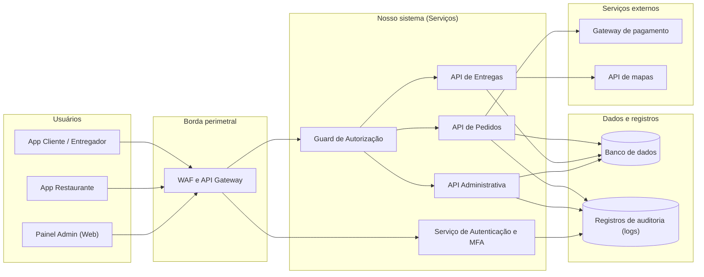

## 12. Diagrama da arquitetura segura

Esta seção apresenta a representação gráfica da arquitetura segura do **Comer-Tchê!**, mapeando as fronteiras de confiança e a posição exata onde os controles de segurança atuarão para mitigar os riscos priorizados.

### 12.1 Visão geral da arquitetura

### 12.2 Onde estão situados os principais controles

1. **WAF & API Gateway (Borda perimetral):** Localizado na entrada pública de todas as conexões. Aplica *Rate Limiting* (máximo de 60 requisições/min por conta/IP) para neutralizar ataques de indisponibilidade no horário de pico (R09) e bloqueia tráfego automatizado de *Credential Stuffing* (R01).
2. **Guard de Autorização Centralizado (Middleware Server-Side):** Atua como interceptador antes de qualquer manipulador de rotas nas APIs. Executa validação de papel do usuário (RBAC) para rotas administrativas (R10) e checa se o pedido pertence ao cliente autenticado (*Ownership Check*) para impedir vulnerabilidades IDOR (R07).
3. **Recálculo Server-Side (API de Pedidos):** Camada de lógica de negócio responsável por reconstruir o valor monetário do pedido a partir dos itens do banco de dados, descartando qualquer total enviado pelo aplicativo (R03).
4. **Serviço de Logs Imutáveis (SIEM / Audit Logs):** Armazena registros apenas-adição (*append-only*) de autenticações, alterações administrativas e falhas de autorização, garantindo rastreabilidade para resolução de disputas (R06).
