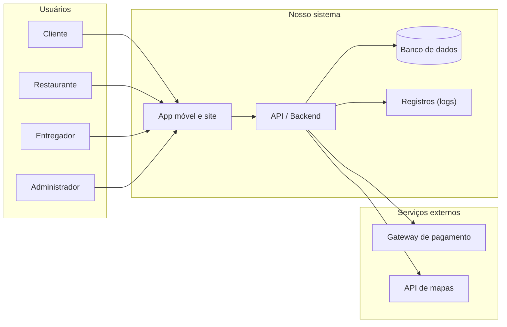

## 4. Visão geral do fluxo

Esta seção mostra, de forma simplificada, quem conversa com quem no Comer-Tchê!. Ela serve de base para a modelagem de ameaças: cada seta é um ponto onde alguma coisa pode dar errado.

### 4.1 Fluxo principal de um pedido

1. O **cliente** faz login no app e escolhe um restaurante.
2. O cliente monta o pedido e confirma o pagamento.
3. A **API** envia o pagamento para o **gateway externo**, que aprova ou recusa.
4. Com o pagamento aprovado, o pedido aparece para o **restaurante**, que aceita e começa a preparar.
5. O pedido é oferecido aos **entregadores** próximos; um deles aceita.
6. O entregador retira o pedido e envia sua localização para a API durante o trajeto, usando a **API de mapas** para a rota.
7. O entregador confirma a entrega e o pedido é encerrado.
8. O cliente avalia o restaurante e o entregador.
9. O **administrador** pode consultar tudo isso: usuários, pedidos, pagamentos e avaliações.

### 4.2 Diagrama de contexto

### 4.3 Onde estão as fronteiras de confiança

Uma **fronteira de confiança** é o ponto em que a informação sai do nosso controle ou chega de alguém em quem não podemos confiar totalmente. São nesses pontos que a maioria das ameaças aparece:

| Fronteira                       | Por que é arriscada                                                                 |
| ------------------------------- | ----------------------------------------------------------------------------------- |
| Entre o app e a API             | O app roda no celular do usuário: ele pode ser alterado, e as requisições podem ser enviadas direto para a API, sem passar pela tela |
| Entre a API e o banco de dados  | É onde ficam concentrados todos os dados pessoais e financeiros                      |
| Entre a API e o gateway de pagamento | Dinheiro real e dados de cartão trafegam por um sistema que não é nosso         |
| Entre a API e a API de mapas    | Enviamos a localização de clientes e entregadores para um terceiro                   |

> Regra prática que vale para todo o trabalho: **nada que chega do app pode ser
> considerado confiável.** Toda checagem importante precisa ser refeita no servidor.
