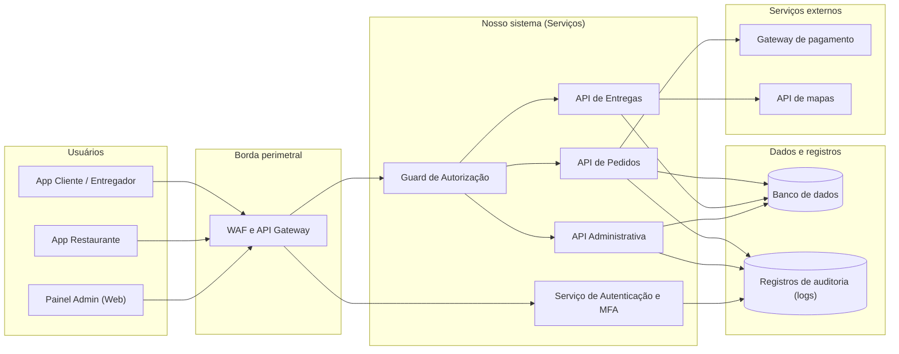

## 12. Diagrama da arquitetura segura

Esta seção mostra como o **Comer-Tchê!** seria organizado internamente e, principalmente, em que ponto cada proteção entra. O diagrama serve para responder uma pergunta: quando uma requisição sai do celular do cliente e chega ao banco de dados, por quais verificações ela passa no caminho?

### 12.1 Visão geral da arquitetura

Três caixas do diagrama precisam de apresentação, porque não existiam na Etapa 1:

- **WAF e API Gateway** formam a *borda perimetral*, o primeiro ponto do nosso sistema que o tráfego encontra. O API Gateway é a porta única por onde toda requisição entra, em vez de cada serviço ser acessado diretamente. O WAF (*Web Application Firewall*) é um filtro que inspeciona essas requisições e barra as que têm cara de ataque ou que chegam em volume anormal.
- **Guard de Autorização** é um trecho de código que roda antes de qualquer serviço, em toda requisição, e decide se aquela pessoa pode fazer aquela operação naquele recurso. É o tipo de componente que a literatura chama de *middleware*: fica no meio do caminho e a requisição só segue adiante se ele deixar.
- **Registros de auditoria** são o histórico de quem fez o quê e quando. Ficam separados do banco de dados principal justamente para que quem consiga mexer nos dados não consiga apagar o rastro.

### 12.2 Onde estão situados os principais controles

1. **WAF e API Gateway, na borda.** Ficam na entrada pública de todas as conexões. Aplicam limite de requisições (*rate limiting*) de no máximo 60 por minuto por conta ou por origem, o que reduz a indisponibilidade no horário de pico (R09). O mesmo limite trava o tráfego automatizado que testa senhas vazadas em massa (R01).
2. **Guard de Autorização centralizado, no servidor.** Intercepta a requisição antes de qualquer código de negócio rodar. Faz duas verificações: se o perfil do usuário pode usar aquela rota, o que fecha o acesso indevido ao painel administrativo (R10); e se o recurso pedido pertence a quem está pedindo, o que impede a leitura de pedidos alheios (R07). Essa segunda checagem é o que se chama de verificação de propriedade (*ownership check*).
3. **Recálculo no servidor, na API de Pedidos.** Reconstrói o valor do pedido a partir dos preços do banco de dados e descarta qualquer total enviado pelo aplicativo (R03).
4. **Registros protegidos contra alteração.** Guardam autenticações, ações administrativas e falhas de autorização em um armazenamento que só aceita acréscimo, nunca edição nem exclusão (*append-only*). É o que garante rastreabilidade para resolver disputas (R06).

## 13. Decisões de arquitetura

Segurança pensada desde o projeto, e não acrescentada depois, é o que se chama de *security by design*. Seguindo esse princípio, o grupo registrou quatro decisões de arquitetura para o **Comer-Tchê!**. Cada uma trata riscos específicos da Etapa 2.

### Decisão 1 — Validação centralizada de autorização no servidor
- **Risco tratado:** **R10** (obtenção de funções administrativas) e **R07** (leitura de pedidos de outros clientes).
- **Decisão tomada:** implementar um único componente de autorização no servidor, atravessado por todas as requisições, que confere o perfil do usuário e a propriedade do recurso antes de a requisição chegar ao código que executa a operação.
- **Justificativa:** esconder botões ou rotas na interface do aplicativo não é proteção, porque qualquer pessoa pode chamar a API diretamente, sem passar pela tela. A verificação precisa acontecer no servidor, e a regra padrão é negar: só passa o que estiver explicitamente autorizado (*default deny*).
- **Componentes afetados:** API Gateway, o Guard de Autorização e todas as rotas da API.
- **Resultado esperado:** qualquer chamada não autorizada retorna o código de erro HTTP `403 Forbidden` e gera um registro de auditoria.

### Decisão 2 — Autoridade total do servidor sobre preços e pagamentos
- **Risco tratado:** **R03** (pedido com valor adulterado) e **R04** (pedido liberado sem pagamento).
- **Decisão tomada:** o servidor é a única fonte do valor. O aplicativo envia apenas quais itens e em que quantidade, nunca o total. Além disso, toda confirmação de pagamento enviada pelo gateway precisa vir acompanhada de uma assinatura criptográfica (HMAC-SHA256), um código calculado com um segredo que só nós e o gateway conhecemos e que prova que a mensagem veio mesmo dele.
- **Justificativa:** o aplicativo roda no celular do cliente, um ambiente fora do nosso controle. Existem programas de uso comum, como o Burp Suite, que interceptam a requisição depois que ela sai da tela e antes de chegar ao servidor, permitindo alterar qualquer campo.
- **Componentes afetados:** API de Pedidos, tabela de preços no banco de dados e o módulo de integração financeira.
- **Resultado esperado:** o valor cobrado passa a depender exclusivamente do servidor, o que fecha o caminho de fraude por alteração do total no aplicativo. A redução só pode ser considerada obtida após implementação, teste e evidência: o risco residual estimado para R03 é baixo (seção 9.6).

### Decisão 3 — Identificadores imprevisíveis e ocultação de dados após a entrega
- **Risco tratado:** **R07** (leitura de pedidos de outros clientes) e **R08** (dados do cliente visíveis fora da entrega).
- **Decisão tomada:** trocar os identificadores numéricos dos recursos por UUID, um identificador aleatório de 32 dígitos como `550e8400-e29b-41d4-a716-446655440000`. Além disso, ocultar telefone e endereço do cliente no aplicativo do entregador assim que a entrega é concluída.
- **Justificativa:** com identificadores em sequência (1, 2, 3...), quem vê o próprio pedido consegue adivinhar o dos outros apenas somando 1, e isso é automatizável. Manter contato e endereço visíveis depois da entrega também não serve a nenhuma necessidade do serviço, e expõe o cliente a assédio, além de contrariar o princípio de minimização de dados da LGPD.
- **Componentes afetados:** modelagem de identificadores no banco de dados e aplicativo do entregador.
- **Resultado esperado:** identificadores deixam de ser adivinháveis por varredura sequencial, e telefone e endereço ficam indisponíveis no aplicativo do entregador assim que a entrega termina. O residual estimado para R08 permanece médio (seção 9.6), porque o acesso durante a entrega em curso é inerente ao serviço.

### Decisão 4 — Defesa em profundidade na borda
- **Risco tratado:** **R09** (indisponibilidade no horário de pico) e **R01** (uso indevido de conta com senhas vazadas).
- **Decisão tomada:** posicionar o WAF e o API Gateway na entrada do sistema, limitando o número de requisições por conta e por origem, e exigir um segundo fator de autenticação quando o login vier de um aparelho não reconhecido.
- **Justificativa:** o delivery tem picos previsíveis, nas noites de sexta e sábado. A borda é o único ponto capaz de distinguir esse uso legítimo de um ataque de volume ou de um robô testando senhas, antes que a carga chegue aos serviços.
- **Componentes afetados:** WAF, API Gateway e serviço de autenticação.
- **Resultado esperado:** disparos massivos de requisições passam a ser barrados na borda, reduzindo a exposição nos horários de maior movimento. O residual estimado para R09 permanece médio (seção 9.6), porque nenhuma proteção elimina a chance de um pico maior que o previsto.

## 14. Considerações finais

### 14.1 Síntese do projeto de arquitetura

A Etapa 3 fecha a passagem do modelo teórico para uma arquitetura concreta. As ameaças vieram do STRIDE na Etapa 1, viraram riscos medidos na Etapa 2 e agora determinam onde cada componente fica e o que cada um verifica.

A postura adotada é a de não confiar em nada que venha de fora do servidor, nem mesmo do nosso próprio aplicativo. Toda requisição tem identidade, perfil, propriedade do recurso e integridade dos dados revalidados no servidor, a cada vez. Essa ideia é conhecida como *zero trust*, confiança zero, e a razão é simples: o celular do cliente e o navegador do administrador estão em ambientes que não controlamos.

### 14.2 Coerência com os riscos das etapas anteriores

As decisões atacam diretamente os riscos priorizados na seção 8.6:

- **Disponibilidade e autenticação (R09 e R01):** tratados na borda, com limite de requisições e segundo fator em aparelho novo (Decisão 4).
- **Confidencialidade e autorização (R07, R08 e R10):** tratados pela verificação centralizada no servidor, pelos identificadores imprevisíveis e pela ocultação dos dados após a entrega (Decisões 1 e 3).
- **Integridade financeira (R03 e R04):** tratada pelo recálculo obrigatório no servidor e pela validação da assinatura do gateway (Decisão 2).

### 14.3 Próximos passos

Os requisitos e as decisões registrados aqui servem de especificação para a Etapa 4, em que o componente de autorização e a validação de preço aparecem em pseudocódigo, com os testes de segurança escritos antes da implementação.
