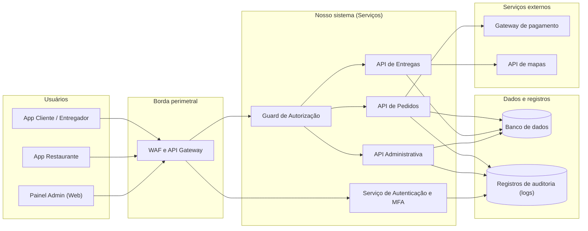

## 12. Diagrama da arquitetura segura

Esta seção apresenta a representação gráfica da arquitetura segura do **Comer-Tchê!**, mapeando as fronteiras de confiança e a posição exata onde os controles de segurança atuarão para mitigar os riscos priorizados.

### 12.1 Visão geral da arquitetura

### 12.2 Onde estão situados os principais controles

1. **WAF & API Gateway (Borda perimetral):** Localizado na entrada pública de todas as conexões. Aplica *Rate Limiting* (máximo de 60 requisições/min por conta/IP) para neutralizar ataques de indisponibilidade no horário de pico (R09) e bloqueia tráfego automatizado de *Credential Stuffing* (R01).
2. **Guard de Autorização Centralizado (Middleware Server-Side):** Atua como interceptador antes de qualquer manipulador de rotas nas APIs. Executa validação de papel do usuário (RBAC) para rotas administrativas (R10) e checa se o pedido pertence ao cliente autenticado (*Ownership Check*) para impedir vulnerabilidades IDOR (R07).
3. **Recálculo Server-Side (API de Pedidos):** Camada de lógica de negócio responsável por reconstruir o valor monetário do pedido a partir dos itens do banco de dados, descartando qualquer total enviado pelo aplicativo (R03).
4. **Serviço de Logs Imutáveis (SIEM / Audit Logs):** Armazena registros apenas-adição (*append-only*) de autenticações, alterações administrativas e falhas de autorização, garantindo rastreabilidade para resolução de disputas (R06).

## 13. Decisões de arquitetura

Para garantir que a segurança seja incorporada por *design* (*Security by Design*), o grupo registrou quatro decisões arquiteturais fundamentais para o **Comer-Tchê!**:

### Decisão 1 — Validação centralizada de autorização no servidor via Middleware
- **Risco tratado:** **R10** (Obtenção de funções administrativas) e **R07** (Leitura de pedidos via IDOR).
- **Decisão tomada:** Implementar um *Middleware* centralizado de Autorização no API Gateway / Backend que valida o perfil do usuário e a propriedade do recurso (*Ownership Check*) antes que a requisição atinja qualquer manipulador de rota (*controller*).
- **Justificativa:** Ocultar botões ou rotas na interface do aplicativo (React/Mobile) não oferece segurança real. A validação precisa ser realizada obrigatoriamente no servidor com a política de "Negação por Padrão" (*Default Deny*).
- **Componentes afetados:** API Gateway, Middlewares de Rota e Endpoints da API.
- **Resultado esperado:** Qualquer chamada não autorizada retorna status HTTP `403 Forbidden` e gera um evento de auditoria.

### Decisão 2 — Autoridade total do servidor para cálculo de preços e pagamentos
- **Risco tratado:** **R03** (Pedido com valor adulterado) e **R04** (Pedido liberado sem pagamento).
- **Decisão tomada:** O backend é a única fonte da verdade para o cálculo de preços, taxas e descontos. O aplicativo móvel envia apenas a lista de IDs dos itens e quantidades. Além disso, as notificações enviadas pelo gateway de pagamento exigem validação de assinatura HMAC-SHA256.
- **Justificativa:** Aplicativos rodando em celulares de clientes executam em ambientes não confiáveis e podem ter suas requisições interceptadas e alteradas por proxies como Burp Suite.
- **Componentes afetados:** API de Pedidos, Banco de Dados (Tabela de Preços) e Módulo de Integração Financeira.
- **Resultado esperado:** O valor cobrado passa a depender exclusivamente do servidor, o que fecha o caminho de fraude por alteração do total no aplicativo. A redução só pode ser considerada obtida após implementação, teste e evidência: o risco residual estimado para R03 é baixo (seção 9.6).

### Decisão 3 — Substituição de IDs sequenciais por UUIDs e mascaramento de dados
- **Risco tratado:** **R07** (Leitura de pedidos via IDOR) e **R08** (Dados do cliente visíveis fora da entrega).
- **Decisão tomada:** Substituir todas as chaves primárias expostas externamente por UUIDs versão 4 imprevisíveis (`/orders/550e8400-e29b-41d4-a716-446655440000`) e aplicar mascaramento dinâmico no telefone e endereço do cliente no aplicativo do entregador assim que a entrega for concluída.
- **Justificativa:** Identificadores numéricos sequenciais (1, 2, 3...) facilitam varreduras automatizadas. Além disso, manter dados de contato visíveis após a entrega expõe o cliente a riscos de assédio e viola as diretrizes da LGPD.
- **Componentes afetados:** Banco de Dados (Modelagem de IDs) e Aplicativo Móvel do Entregador.
- **Resultado esperado:** Identificadores deixam de ser adivinháveis por varredura sequencial, e telefone e endereço ficam indisponíveis no aplicativo do entregador assim que a entrega termina. O residual estimado para R08 permanece médio (seção 9.6), porque o acesso durante a entrega em curso é inerente ao serviço.

### Decisão 4 — Proteção em profundidade na borda com WAF e Rate Limiting
- **Risco tratado:** **R09** (Indisponibilidade no horário de pico) e **R01** (Uso indevido de conta por *Credential Stuffing*).
- **Decisão tomada:** Posicionar um Web Application Firewall (WAF) e API Gateway na borda aplicando limitação de requisições (*Rate Limiting*) por conta e por IP, acompanhado de desafio de MFA no login em dispositivos não reconhecidos.
- **Justificativa:** O sistema de delivery possui picos previsíveis de uso (finais de semana) e precisa distinguir o uso legítimo de ataques de negação de serviço ou robôs disparando senhas vazadas.
- **Componentes afetados:** WAF, API Gateway e Serviço de Autenticação.
- **Resultado esperado:** Disparos massivos de requisições passam a ser barrados na borda, reduzindo a exposição nos horários de maior movimento. O residual estimado para R09 permanece médio (seção 9.6), porque nenhuma proteção elimina a chance de um pico maior que o previsto.

## 14. Considerações finais

### 14.1 Síntese do projeto de arquitetura
A Etapa 3 consolida a transição do modelo teórico de ameaças (STRIDE) e de riscos (NIST CSF 2.0) para uma arquitetura defensiva concreta no **Comer-Tchê!**. 

O projeto adotou uma postura de **Zero Trust** (Confiança Zero) interna: assume-se que requisições originadas de clientes móveis ou web vêm de ambientes não confiáveis, exigindo a revalidação contínua de identidade, perfil de acesso (RBAC), autorização de recurso e integridade de dados diretamente no servidor.

### 14.2 Coerência com os riscos e etapas anteriores
As decisões tomadas atacam diretamente os pontos mais críticos levantados nas etapas anteriores:
- **Disponibilidade e Autenticação (R09 e R01):** Mitigados na borda com WAF, *Rate Limiting* e MFA.
- **Confidencialidade e Autorização (R07, R08 e R10):** Tratados via *Middlewares* de autorização, substituição por UUIDs e mascaramento pós-entrega.
- **Integridade Financeira (R03 e R04):** Garantida pelo recálculo *server-side* obrigatório e validação de webhooks por assinatura HMAC.

### 14.3 Próximos passos
Os requisitos e decisões arquiteturais aqui registrados servirão como especificação para a **Etapa 4 (Código Seguro e Testes de Segurança)**, na qual apresentaremos trechos de código/pseudocódigo contendo a implementação dos *Middlewares* de autorização e a escrita prévia dos testes automatizados de segurança.
